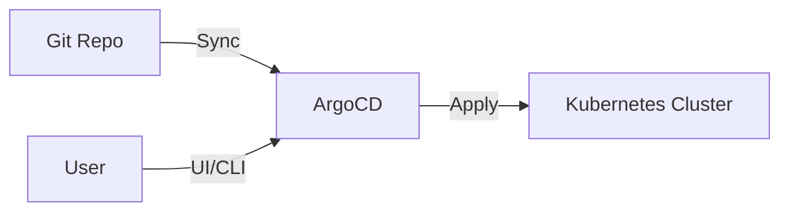

# ArgoCD

> **Description:** Declarative, GitOps continuous delivery tool for Kubernetes.
> **Version:** Chart v5.x (ArgoCD v2.9+)
> **Last Updated:** 2025-12-04

## 📋 Prerequisites

List requirements before installation:
- [ ] Kubernetes Cluster v1.20+
- [ ] Helm v3+
- [ ] Git Repository (for storing manifests)

---

## 🏗️ Architecture

ArgoCD runs as a controller in the cluster, monitoring running applications and comparing the current live state against the desired target state (as specified in the Git repo).



---

## 🚀 Installation Guide

### Option 1: Installation via Helm

```bash
# 1. Add Helm Repo
helm repo add argo https://argoproj.github.io/argo-helm
helm repo update

# 2. Create Namespace
kubectl create ns argocd

# 3. Install/Upgrade
helm upgrade --install argocd argo/argo-cd \
  -n argocd \
  -f values.yaml
```

---

## ⚙️ Configuration Details

**Key Configurations** (values.yaml)

| Parameter | Description | Default | Recommended |
| :--- | :--- | :--- | :--- |
| `server.ingress.enabled` | Enable Ingress | `false` | `true` |
| `server.ingress.hosts` | Hostname | `[]` | `[argocd.example.com]` |
| `configs.params.server.insecure` | Disable TLS (if terminated at Ingress) | `false` | `true` |
| `dex.enabled` | Enable Dex (SSO) | `true` | `true` |

---

## ✅ Verification & Usage

### 1. Get Admin Password
```bash
kubectl -n argocd get secret argocd-initial-admin-secret -o jsonpath="{.data.password}" | base64 -d; echo
```

### 2. Access UI
Go to `https://argocd.example.com` and login with `admin` and the password above.

### 3. Create an Application
```bash
argocd app create guestbook --repo https://github.com/argoproj/argocd-example-apps.git --path guestbook --dest-server https://kubernetes.default.svc --dest-namespace default
```

---

## 🔧 Maintenance & Operations

- **Upgrading**: `helm upgrade argocd argo/argo-cd -n argocd -f values.yaml`
- **Backup**: ArgoCD is stateless (config is in Git), but you can backup CRDs and Secrets if needed.

---

## 📊 Monitoring & Alerts

- **Metrics**: ArgoCD exposes Prometheus metrics on port 8082.
- **Alerts**: Monitor `argocd_app_sync_status` to detect out-of-sync apps.

---

## ❓ Troubleshooting

Common issues and fixes:

| Issue | Cause | Solution |
| :--- | :--- | :--- |
| App OutOfSync | Manual changes in cluster | Sync with `Prune` enabled |
| Login failed | Wrong password or SSO issue | Check Dex logs |

---

## 📚 References

- [ArgoCD Documentation](https://argo-cd.readthedocs.io/en/stable/)
- [Argo Helm Charts](https://github.com/argoproj/argo-helm)
