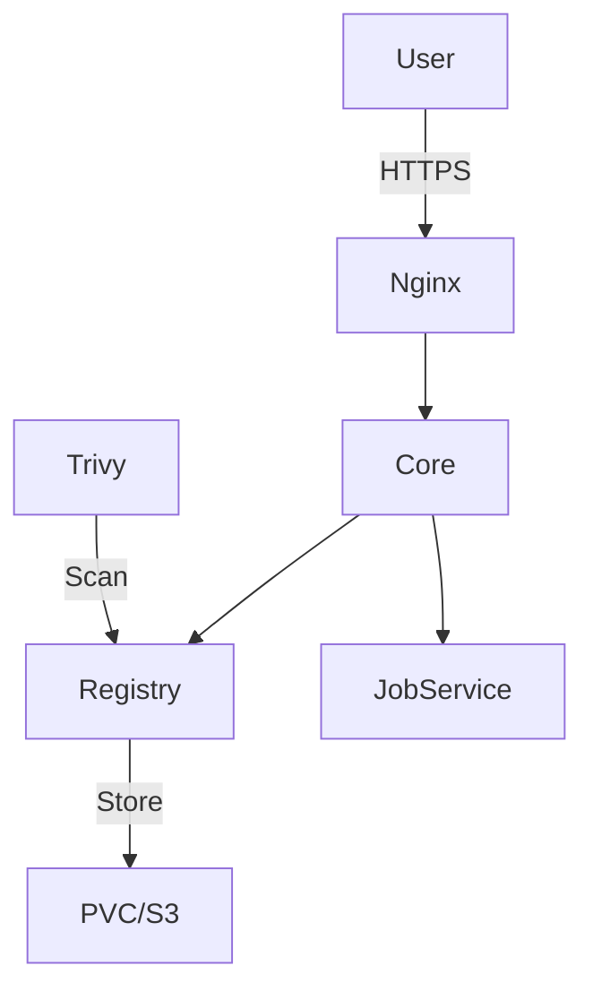

# Harbor

> **Description:** Open source trusted cloud native registry project that stores, signs, and scans content.
> **Version:** Chart v1.14.x (Harbor v2.10+)
> **Last Updated:** 2025-12-04

## 📋 Prerequisites

List requirements before installation:
- [ ] Kubernetes Cluster v1.20+
- [ ] Helm v3+
- [ ] Storage Class (Standard)
- [ ] Domain Name & TLS Certificate

---

## 🏗️ Architecture

Harbor is composed of many services: Core, JobService, Registry, ChartMuseum, Notary, Trivy, Redis, and PostgreSQL.



---

## 🚀 Installation Guide

### Option 1: Installation via Helm

```bash
# 1. Add Helm Repo
helm repo add harbor https://helm.goharbor.io
helm repo update

# 2. Create Namespace
kubectl create ns harbor

# 3. Install/Upgrade
helm upgrade --install harbor harbor/harbor \
  -n harbor \
  -f values.yaml
```

---

## ⚙️ Configuration Details

**Key Configurations** (values.yaml)

| Parameter | Description | Default | Recommended |
| :--- | :--- | :--- | :--- |
| `expose.type` | Expose Type | `ingress` | `ingress` |
| `externalURL` | Public URL | `https://harbor.domain` | **Required** |
| `persistence.persistentVolumeClaim` | Storage | `registry: 5Gi` | `50Gi+` (or S3) |

---

## ✅ Verification & Usage

### 1. Access UI
Navigate to `https://harbor.example.com`. Default admin credentials: `admin` / `Harbor12345`.

### 2. Push Image
```bash
docker login harbor.example.com
docker tag my-image harbor.example.com/library/my-image
docker push harbor.example.com/library/my-image
```

---

## 🔧 Maintenance & Operations

- **Upgrading**: Follow official migration guides. Database migrations are handled by the chart.
- **Garbage Collection**: Run via UI to clean up unused layers.

---

## 📊 Monitoring & Alerts

- **Metrics**: Enable `metrics.enabled` to expose Prometheus metrics.

---

## ❓ Troubleshooting

Common issues and fixes:

| Issue | Cause | Solution |
| :--- | :--- | :--- |
| Login Failed | 401 Unauthorized | Check credentials/OIDC |
| Push Failed | 413 Payload Too Large | Increase Ingress body size |

---

## 📚 References

- [Harbor Helm Chart](https://github.com/goharbor/harbor-helm)
- [Harbor Docs](https://goharbor.io/docs/)
