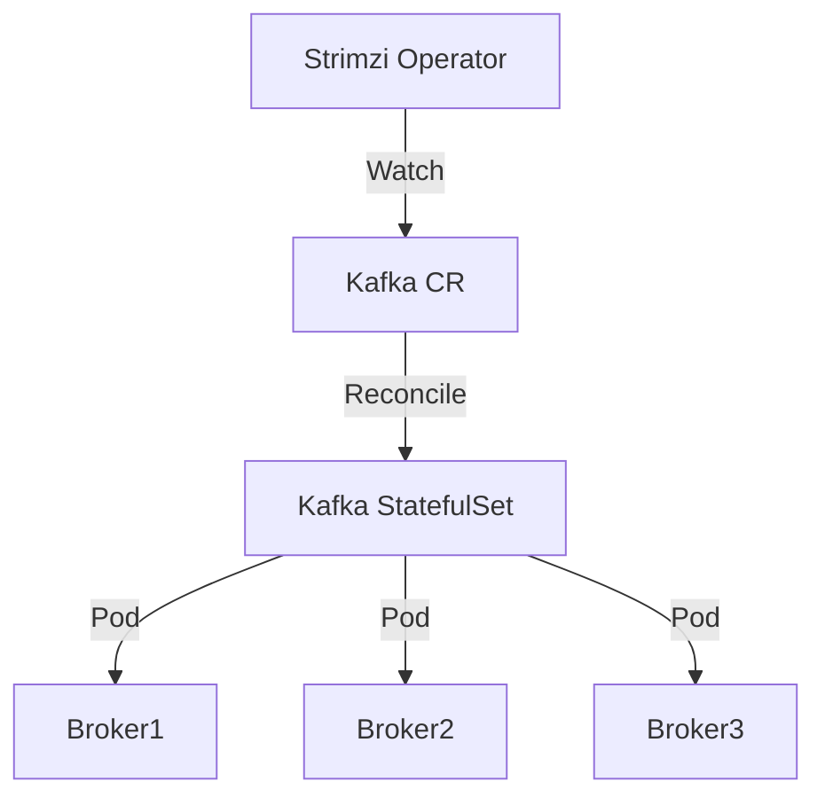

# Apache Kafka (Strimzi Operator)

> **Description:** Enterprise-grade Kafka on Kubernetes using the Strimzi Operator. Supports KRaft mode.
> **Version:** Strimzi v0.38.x (Kafka v3.6+)
> **Last Updated:** 2025-12-04

## 📋 Prerequisites

List requirements before installation:
- [ ] Kubernetes Cluster v1.23+
- [ ] Helm v3+

---

## 🏗️ Architecture

Strimzi uses the **Operator Pattern**. You install the Operator first, then create a `Kafka` Custom Resource (CR) to deploy the cluster.



---

## 🚀 Installation Guide

### 1. Install Strimzi Operator

```bash
# 1. Add Helm Repo
helm repo add strimzi https://strimzi.io/charts/
helm repo update

# 2. Create Namespace
kubectl create ns kafka

# 3. Install Operator
helm upgrade --install strimzi-kafka-operator strimzi/strimzi-kafka-operator \
  -n kafka \
  --set watchAnyNamespace=true
```

### 2. Deploy Kafka Cluster

Apply the Custom Resource definition to create the cluster.

```bash
kubectl apply -f kafka.yaml -n kafka
```

---

## ⚙️ Configuration Details

**Key Configurations** (kafka.yaml)

| Parameter | Description | Default | Recommended |
| :--- | :--- | :--- | :--- |
| `spec.kafka.replicas` | Number of brokers | `3` | `3` |
| `spec.kafka.storage` | Storage type | `jbod` | `jbod` (Persistent) |
| `spec.kafka.listeners` | Listeners (Plain, TLS, External) | `plain, tls` | `plain, tls` |
| `spec.entityOperator` | User/Topic Operator | `enabled` | `enabled` |

---

## ✅ Verification & Usage

### 1. Check Status
```bash
kubectl get kafka -n kafka
# Wait for READY: True
```

### 2. Produce/Consume
```bash
# Start a producer
kubectl -n kafka run kafka-producer -ti --image=quay.io/strimzi/kafka:0.38.0-kafka-3.6.0 --rm=true --restart=Never -- bin/kafka-console-producer.sh --bootstrap-server my-cluster-kafka-bootstrap:9092 --topic my-topic

# Start a consumer
kubectl -n kafka run kafka-consumer -ti --image=quay.io/strimzi/kafka:0.38.0-kafka-3.6.0 --rm=true --restart=Never -- bin/kafka-console-consumer.sh --bootstrap-server my-cluster-kafka-bootstrap:9092 --topic my-topic --from-beginning
```

---

## 🔧 Maintenance & Operations

- **Upgrading**: Upgrade the Operator Helm chart first. Strimzi handles the rolling update of brokers.
- **Scaling**: Edit `kafka.yaml` -> change `replicas` -> `kubectl apply`.

---

## 📊 Monitoring & Alerts

- **Metrics**: Strimzi supports Prometheus via the `metricsConfig` in the CR.

---

## ❓ Troubleshooting

Common issues and fixes:

| Issue | Cause | Solution |
| :--- | :--- | :--- |
| CrashLoopBackOff | OOM or Storage | Check PVC and Resources |
| Operator not reconciling | RBAC issues | Check Operator logs |

---

## 📚 References

- [Strimzi Documentation](https://strimzi.io/docs/operators/latest/full/deploying.html)
