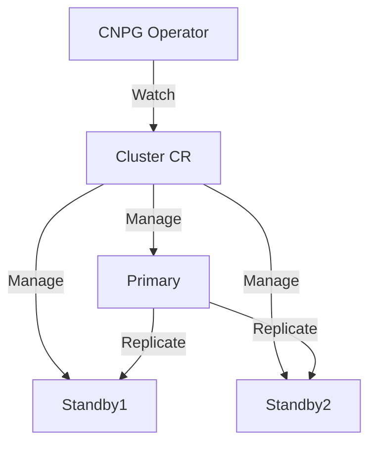

# PostgreSQL (CloudNativePG)

> **Description:** Production-grade PostgreSQL on Kubernetes using the CloudNativePG Operator.
> **Version:** Operator v1.22+ (Postgres v16.x)
> **Last Updated:** 2025-12-04

## 📋 Prerequisites

List requirements before installation:
- [ ] Kubernetes Cluster v1.21+
- [ ] Helm v3+

---

## 🏗️ Architecture

CloudNativePG manages a **Cluster** of PostgreSQL instances with primary-standby replication.



---

## 🚀 Installation Guide

### 1. Install CloudNativePG Operator

```bash
# 1. Add Helm Repo
helm repo add cnpg https://cloudnative-pg.github.io/charts
helm repo update

# 2. Create Namespace
kubectl create ns cnpg-system

# 3. Install Operator
helm upgrade --install cnpg cnpg/cloudnative-pg \
  -n cnpg-system \
  --create-namespace
```

### 2. Deploy PostgreSQL Cluster

Apply the Cluster Custom Resource.

```bash
kubectl create ns postgres
kubectl apply -f cluster.yaml -n postgres
```

### Optional: Enable Monitoring

```bash
kubectl apply -f monitoring.yaml -n postgres
```

---

## ⚙️ Configuration Details

**Key Configurations** (cluster.yaml)

| Parameter | Description | Default | Recommended |
| :--- | :--- | :--- | :--- |
| `instances` | Number of replicas | `3` | `3` (HA) |
| `storage.size` | Disk Size | `1Gi` | `10Gi+` |
| `bootstrap.initdb` | Initial DB | `app` | `your-db` |

---

## ✅ Verification & Usage

### 1. Check Status
```bash
kubectl get cluster -n postgres
kubectl cnpg status my-cluster -n postgres
```

### 2. Connect
```bash
# Get password (default user is 'app')
kubectl get secret my-cluster-app -n postgres -o jsonpath="{.data.password}" | base64 -d

# Port forward
kubectl port-forward svc/my-cluster-rw 5432:5432 -n postgres
```

---

## 🔧 Maintenance & Operations

- **Upgrading**: Update `imageName` in `cluster.yaml`. The operator handles rolling updates.
- **Backups**: Configure `backup` section in CR to use S3/GCS.

---

## 📊 Monitoring & Alerts

- **Metrics**: Enable `monitoring: true` in CR to expose Prometheus metrics.

---

## ❓ Troubleshooting

Common issues and fixes:

| Issue | Cause | Solution |
| :--- | :--- | :--- |
| Pod Pending | PVC not bound | Check StorageClass |
| Replication Lag | Network/Disk I/O | Check metrics |

---

## 📚 References

- [CloudNativePG Docs](https://cloudnative-pg.io/documentation/current/)
