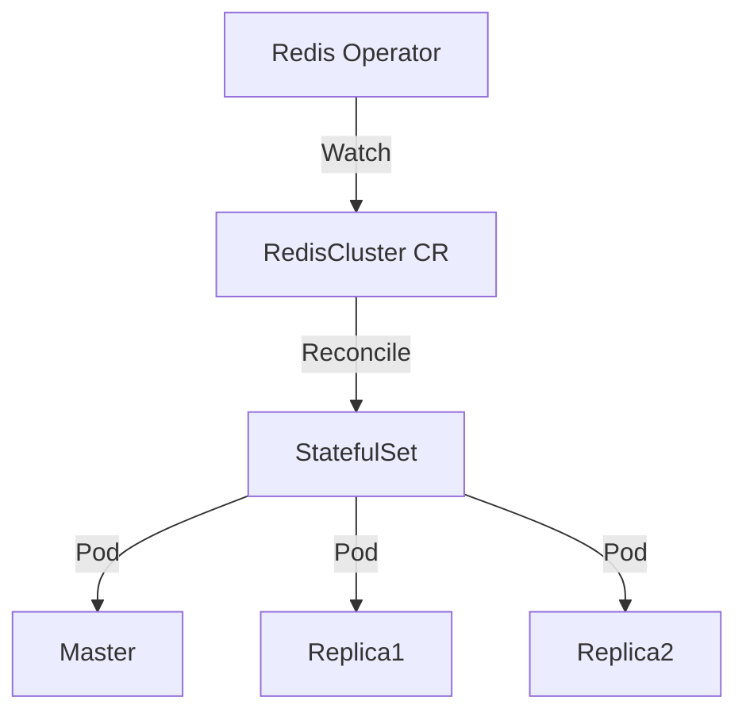

# Redis (Opstree Operator)

> **Description:** Enterprise-grade Redis on Kubernetes using the Opstree Operator. Supports Standalone, Cluster, and Sentinel modes.
> **Version:** Operator v0.15.x (Redis v7.x)
> **Last Updated:** 2025-12-04

## 📋 Prerequisites

List requirements before installation:
- [ ] Kubernetes Cluster v1.20+
- [ ] Helm v3+

---

## 🏗️ Architecture

The Opstree Operator manages the lifecycle of Redis clusters.



---

## 🚀 Installation Guide

### 1. Install Redis Operator

```bash
# 1. Add Helm Repo
helm repo add ot-helm https://ot-container-kit.github.io/helm-charts/
helm repo update

# 2. Create Namespace
kubectl create ns redis-operator

# 3. Install Operator
helm upgrade --install redis-operator ot-helm/redis-operator \
  -n redis-operator
```

### 2. Deploy Redis Cluster

Apply the Custom Resource definition to create the cluster.

```bash
kubectl create ns redis
kubectl apply -f redis-cluster.yaml -n redis
```

---

## ⚙️ Configuration Details

**Key Configurations** (redis-cluster.yaml)

| Parameter | Description | Default | Recommended |
| :--- | :--- | :--- | :--- |
| `spec.clusterSize` | Number of nodes | `3` | `3` |
| `spec.redisLeader.redisConfig` | Redis Config | `...` | Tune maxmemory |
| `spec.storage` | Persistence | `pvc` | `pvc` |

---

## ✅ Verification & Usage

### 1. Check Status
```bash
kubectl get rediscluster -n redis
# Wait for Ready
```

### 2. Connect
```bash
# Get password
kubectl get secret -n redis my-redis-secret -o jsonpath="{.data.password}" | base64 -d

# Connect
kubectl exec -it -n redis my-redis-leader-0 -- redis-cli -a <password>
```

---

## 🔧 Maintenance & Operations

- **Upgrading**: Upgrade Operator chart, then update `redis-cluster.yaml` image version.

---

## 📊 Monitoring & Alerts

- **Metrics**: Enable `redisExporter` in the CR to expose metrics for Prometheus.

---

## ❓ Troubleshooting

Common issues and fixes:

| Issue | Cause | Solution |
| :--- | :--- | :--- |
| Pod Pending | PVC not bound | Check StorageClass |
| Auth Error | Wrong password | Check Secret |

---

## 📚 References

- [Opstree Redis Operator](https://github.com/OT-CONTAINER-KIT/redis-operator)
