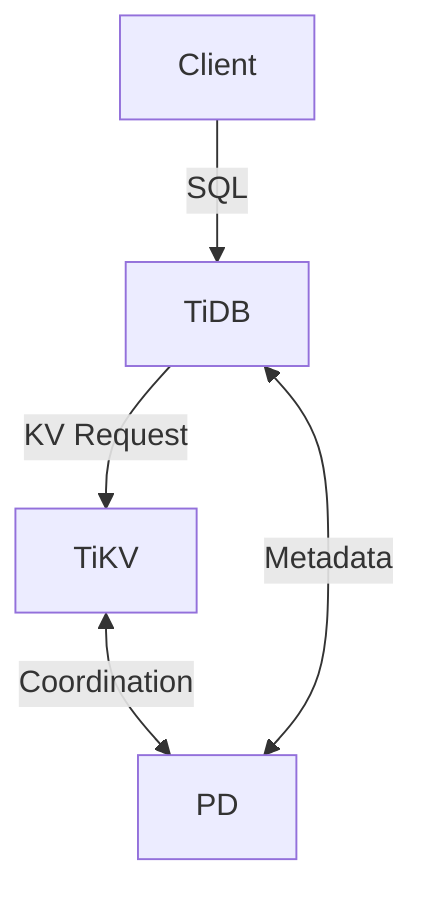

# TiDB

> **Description:** Open-source, cloud-native distributed SQL database that supports Hybrid Transactional and Analytical Processing (HTAP).
> **Version:** Operator v1.5.x (TiDB v7.x)
> **Last Updated:** 2025-12-04

## 📋 Prerequisites

List requirements before installation:
- [ ] Kubernetes Cluster v1.23+
- [ ] Minimum RAM: 16GB+ (TiDB is resource intensive)
- [ ] Helm v3+
- [ ] Storage Class (Local PV recommended for performance)

---

## 🏗️ Architecture

TiDB cluster consists of PD (Placement Driver), TiKV (Key-Value Storage), and TiDB (SQL Layer).



---

## 🚀 Installation Guide

### Option 1: Installation via Helm (TiDB Operator)

```bash
# 1. Install CRDs
kubectl create -f https://raw.githubusercontent.com/pingcap/tidb-operator/master/manifests/crd.yaml

# 2. Add Helm Repo
helm repo add pingcap https://charts.pingcap.org/
helm repo update

# 3. Install Operator
helm upgrade --install tidb-operator pingcap/tidb-operator \
  -n tidb-admin --create-namespace

# 4. Install TiDB Cluster
helm upgrade --install tidb-cluster pingcap/tidb-cluster \
  -n tidb --create-namespace \
  -f values.yaml
```

---

## ⚙️ Configuration Details

**Key Configurations** (values.yaml)

| Parameter | Description | Default | Recommended |
| :--- | :--- | :--- | :--- |
| `pd.replicas` | PD Replicas | `3` | `3` |
| `tikv.replicas` | TiKV Replicas | `3` | `3` |
| `tidb.replicas` | TiDB Replicas | `2` | `2+` |
| `tikv.storageClassName` | Storage Class | `local-storage` | `local-storage` |

---

## ✅ Verification & Usage

### 1. Connect to TiDB
```bash
kubectl port-forward svc/tidb-cluster-tidb 4000:4000 -n tidb
mysql -h 127.0.0.1 -P 4000 -u root
```

### 2. Verify Cluster Status
```bash
kubectl get pods -n tidb
# Check PD, TiKV, and TiDB pods are running.
```

---

## 🔧 Maintenance & Operations

- **Scaling**: Update `replicas` in `values.yaml` and apply.
- **Upgrading**: Upgrade Operator first, then the Cluster.

---

## 📊 Monitoring & Alerts

- **TiDB Dashboard**: Accessible via PD.
- **Grafana**: TiDB Operator can deploy a monitoring stack.

---

## ❓ Troubleshooting

Common issues and fixes:

| Issue | Cause | Solution |
| :--- | :--- | :--- |
| TiKV Pending | No PV available | Check StorageClass/PVs |
| TiDB OOM | Query too large | Optimize SQL or increase RAM |

---

## 📚 References

- [TiDB Operator Docs](https://docs.pingcap.com/tidb-in-kubernetes/stable)
- [PingCAP Charts](https://github.com/pingcap/helm-charts)
