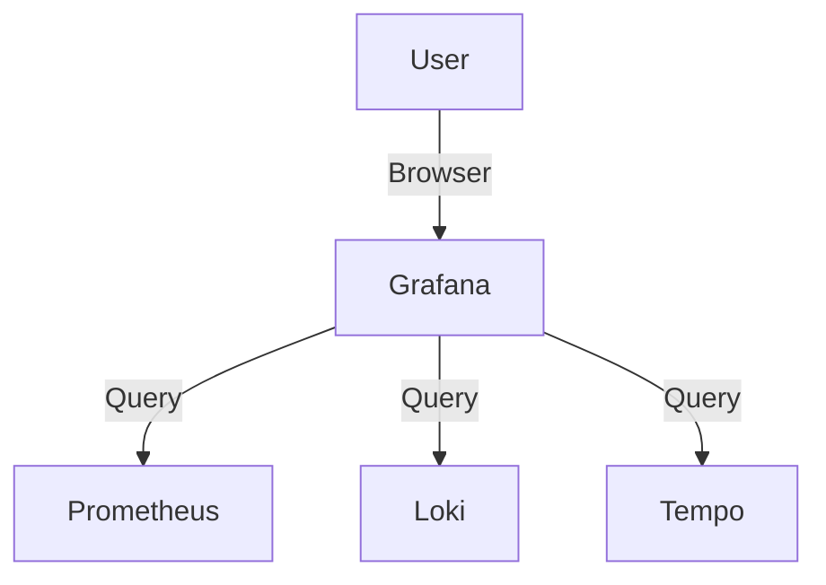

# Grafana (Standalone)

> **Description:** The open observability platform. Visualize metrics, logs, and traces.
> **Version:** Chart v7.x (Grafana v10.x)
> **Last Updated:** 2025-12-04

## 📋 Prerequisites

List requirements before installation:
- [ ] Kubernetes Cluster v1.20+
- [ ] Helm v3+
- [ ] Persistent Storage (for dashboards/users)

---

## 🏗️ Architecture

Grafana connects to various data sources (Prometheus, Loki, Tempo, PostgreSQL, etc.) to visualize data.



---

## 🚀 Installation Guide

### Option 1: Installation via Helm

```bash
# 1. Add Helm Repo
helm repo add grafana https://grafana.github.io/helm-charts
helm repo update

# 2. Create Namespace
kubectl create ns monitoring

# 3. Install/Upgrade
helm upgrade --install grafana grafana/grafana \
  -n monitoring \
  -f values.yaml
```

---

### Option 2: Install with External Database (PostgreSQL)

Use an external database for stateless Grafana pods.

**1. Prepare PostgreSQL**
```sql
CREATE DATABASE grafana;
CREATE USER grafana WITH PASSWORD 'password';
GRANT ALL PRIVILEGES ON DATABASE grafana TO grafana;
```

**2. Create Secret**
```sh
kubectl create secret generic grafana-db-secret --from-literal=password='YOUR_DB_PASSWORD'
```

**3. Update `values.yaml`**
```yaml
grafana.ini:
  database:
    type: postgres
    host: postgres-cluster-rw.database.svc.cluster.local:5432
    name: grafana
    user: grafana
    password: password
    ssl_mode: disable
```

**4. Install with Helm**
```bash
helm upgrade --install grafana grafana/grafana \
  -n monitoring \
  -f values.yaml
```

---

## ⚙️ Configuration Details

**Key Configurations** (values.yaml)

| Parameter | Description | Default | Recommended |
| :--- | :--- | :--- | :--- |
| `adminPassword` | Admin Password | `admin` | `secure-password` |
| `persistence.enabled` | Enable Persistence | `false` | `true` |
| `datasources` | Pre-configure sources | `{}` | Add Prometheus/Loki |

---

## ✅ Verification & Usage

### 1. Access Grafana
```bash
kubectl port-forward svc/grafana 3000:80 -n monitoring
# Login at http://localhost:3000
```

### 2. Verify Data Sources
Go to **Connections** -> **Data Sources** and ensure configured sources are working.

---

## 🔧 Maintenance & Operations

- **Upgrading**: `helm upgrade ...`.
- **Plugins**: Add plugins via `plugins` list in `values.yaml`.

---

## 📊 Monitoring & Alerts

- **Metrics**: Grafana exposes its own metrics at `/metrics`.

---

## ❓ Troubleshooting

Common issues and fixes:

| Issue | Cause | Solution |
| :--- | :--- | :--- |
| Pod CrashLoop | Permission issue on PVC | Check `fsGroup` |
| Login Failed | Wrong password | Reset admin password |

---

## 📚 References

- [Grafana Helm Chart](https://github.com/grafana/helm-charts/tree/main/charts/grafana)
