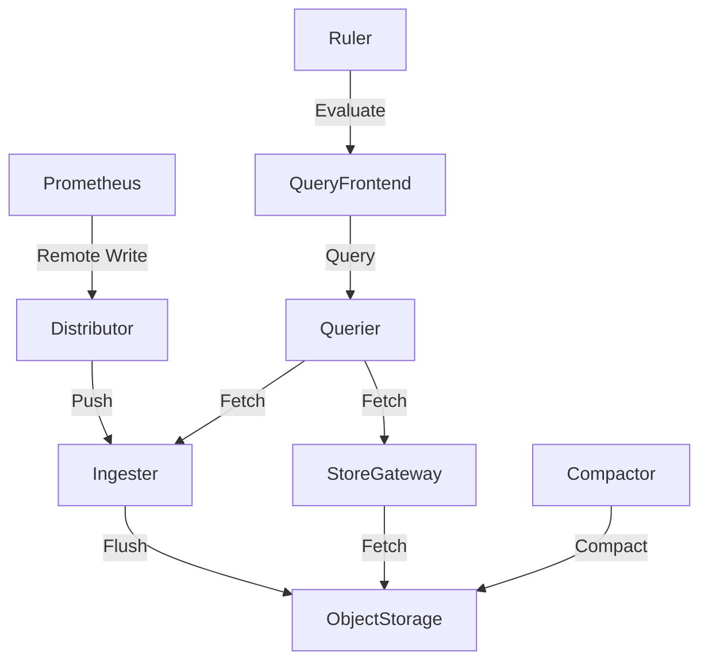

# Grafana Mimir

> **Description:** Scalable, long-term storage for Prometheus.
> **Version:** Chart v5.x (Mimir v2.10+)
> **Last Updated:** 2025-12-04

## 📋 Prerequisites

List requirements before installation:
- [ ] Kubernetes Cluster v1.24+
- [ ] Helm v3+
- [ ] Object Storage (S3, GCS, Azure Blob, or MinIO)
- [ ] Prometheus (for scraping and remote write)

---

## 🏗️ Architecture

Mimir uses a microservices architecture to provide horizontally scalable, multi-tenant, long-term storage for Prometheus.



---

## 🚀 Installation Guide

### Option 1: Installation via Helm

```bash
# 1. Add Helm Repo
helm repo add grafana https://grafana.github.io/helm-charts
helm repo update

# 2. Create Namespace
kubectl create ns mimir

# 3. Create Object Storage Secret (Example for S3)
kubectl create secret generic mimir-objstore-secret \
  --from-literal=bucket_name=<BUCKET_NAME> \
  --from-literal=access_key_id=<AWS_ACCESS_KEY_ID> \
  --from-literal=secret_access_key=<AWS_SECRET_ACCESS_KEY> \
  -n mimir

# 4. Install/Upgrade
helm upgrade --install mimir grafana/mimir-distributed \
  -n mimir \
  -f values.yaml
```

---

## ⚙️ Configuration Details

**Key Configurations** (values.yaml)

| Parameter | Description | Default | Recommended |
| :--- | :--- | :--- | :--- |
| `minio.enabled` | Enable internal MinIO | `true` | `false` (Prod) |
| `alertmanager.enabled` | Enable Alertmanager | `true` | `true` |
| `ruler.enabled` | Enable Ruler | `true` | `true` |
| `ingester.replicas` | Ingester Replicas | `3` | `3+` |
| `store_gateway.replicas` | Store Gateway Replicas | `3` | `3+` |

---

## ✅ Verification & Usage

### 1. Access UI
Mimir does not have a native UI for data visualization; use Grafana.
However, you can access the status page:
```bash
kubectl port-forward svc/mimir-nginx 8080:80 -n mimir
# http://localhost:8080/services
```

### 2. Configure Prometheus Remote Write
Update your Prometheus configuration to send metrics to Mimir:
```yaml
remote_write:
  - url: http://mimir-nginx.mimir.svc:80/api/v1/push
```

### 3. Query Data in Grafana
Add a Prometheus data source in Grafana pointing to Mimir:
- **URL:** `http://mimir-nginx.mimir.svc:80/prometheus`

---

## 🔧 Maintenance & Operations

- **Scaling**: Scale `ingester` and `querier` based on load.
- **Compaction**: Ensure `compactor` is running to merge blocks and enforce retention.

---

## 📊 Monitoring & Alerts

- **Mimir Mixin**: Use the official Mimir Mixin for dashboards and alerts.
- **Self-Monitoring**: Mimir exposes metrics at `/metrics`.

---

## ❓ Troubleshooting

Common issues and fixes:

| Issue | Cause | Solution |
| :--- | :--- | :--- |
| Ingester OOM | High cardinality/ingestion rate | Scale out ingesters or increase memory |
| Slow Queries | Large time range or high cardinality | Scale out queriers or use recording rules |
| 500 Errors | Component failure | Check logs of distributors/ingesters |

---

## 📚 References

- [Grafana Mimir Documentation](https://grafana.com/docs/mimir/latest/)
- [Mimir Helm Chart](https://github.com/grafana/helm-charts/tree/main/charts/mimir-distributed)
