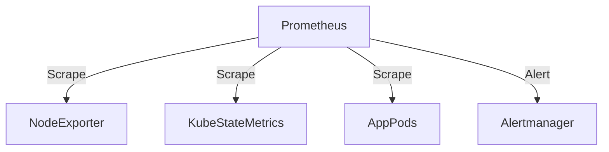

# Prometheus (Standalone)

> **Description:** The leading open-source monitoring system.
> **Version:** Chart v25.x (Prometheus v2.47+)
> **Last Updated:** 2025-12-04

## 📋 Prerequisites

List requirements before installation:
- [ ] Kubernetes Cluster v1.20+
- [ ] Helm v3+
- [ ] Persistent Storage

---

## 🏗️ Architecture

Prometheus scrapes metrics from targets, stores them in a TSDB, and evaluates alerting rules.



---

## 🚀 Installation Guide

### Option 1: Installation via Helm

```bash
# 1. Add Helm Repo
helm repo add prometheus-community https://prometheus-community.github.io/helm-charts
helm repo update

# 2. Create Namespace
kubectl create ns monitoring

# 3. Install/Upgrade
helm upgrade --install prometheus prometheus-community/prometheus \
  -n monitoring \
  -f values.yaml
```

---

## ⚙️ Configuration Details

**Key Configurations** (values.yaml)

| Parameter | Description | Default | Recommended |
| :--- | :--- | :--- | :--- |
| `server.retention` | Data Retention | `15d` | `30d+` |
| `server.persistentVolume.size` | Storage Size | `8Gi` | `50Gi+` |
| `alertmanager.enabled` | Enable Alertmanager | `true` | `true` |

---

## ✅ Verification & Usage

### 1. Access UI
```bash
kubectl port-forward svc/prometheus-server 9090:80 -n monitoring
# http://localhost:9090
```

### 2. Verify Targets
Check **Status** -> **Targets** to ensure standard targets are UP.

---

## 🔧 Maintenance & Operations

- **Reload Config**: `curl -X POST http://localhost:9090/-/reload` (if enabled).

---

## 📊 Monitoring & Alerts

- **Self-Monitoring**: Prometheus monitors itself.

---

## ❓ Troubleshooting

Common issues and fixes:

| Issue | Cause | Solution |
| :--- | :--- | :--- |
| Target Down | Network/Port issue | Check Service/Pod IP |
| OOM Killed | High cardinality | Increase RAM or drop metrics |

---

## 📚 References

- [Prometheus Helm Chart](https://github.com/prometheus-community/helm-charts/tree/main/charts/prometheus)
