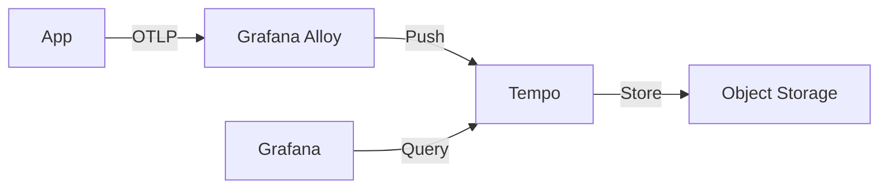

# Grafana Tempo

> **Description:** High-scale, cost-effective distributed tracing backend.
> **Version:** Chart v1.x (Tempo v2.x)
> **Last Updated:** 2025-12-04

## 📋 Prerequisites

List requirements before installation:
- [ ] Kubernetes Cluster v1.20+
- [ ] Helm v3+
- [ ] Object Storage (S3/GCS) - **Required** for traces

---

## 🏗️ Architecture

Tempo ingests traces from OTLP/Jaeger/Zipkin, stores them in Object Storage, and allows querying via Grafana.



---

## 🚀 Installation Guide

### Option 1: Installation via Helm

```bash
# 1. Add Helm Repo
helm repo add grafana https://grafana.github.io/helm-charts
helm repo update

# 2. Create Namespace
kubectl create ns monitoring

# 3. Install/Upgrade
helm upgrade --install tempo grafana/tempo \
  -n monitoring \
  -f values.yaml
```

---

## ⚙️ Configuration Details

**Key Configurations** (values.yaml)

| Parameter | Description | Default | Recommended |
| :--- | :--- | :--- | :--- |
| `tempo.storage.trace.backend` | Storage Backend | `local` | `s3` |
| `tempo.receivers` | Protocols | `otlp, jaeger` | `otlp` |

---

## ✅ Verification & Usage

### 1. Access Grafana
Add **Tempo** data source in Grafana pointing to `http://tempo.monitoring.svc.cluster.local:3100`.

### 2. Send Traces
Configure your application or Grafana Alloy to send OTLP traces to `tempo.monitoring.svc.cluster.local:4317`.

---

## 🔧 Maintenance & Operations

- **Retention**: Configure retention in `tempo.retention`.
- **Compaction**: Tempo compacts blocks in S3.

---

## 📊 Monitoring & Alerts

- **Metrics**: Tempo exposes metrics for ingestion rates and errors.

---

## ❓ Troubleshooting

Common issues and fixes:

| Issue | Cause | Solution |
| :--- | :--- | :--- |
| Ingestion Failed | Wrong protocol/port | Check OTLP (4317) vs HTTP (4318) |
| S3 Error | Bad credentials | Check Secret |

---

## 📚 References

- [Tempo Helm Chart](https://github.com/grafana/helm-charts/tree/main/charts/tempo)
