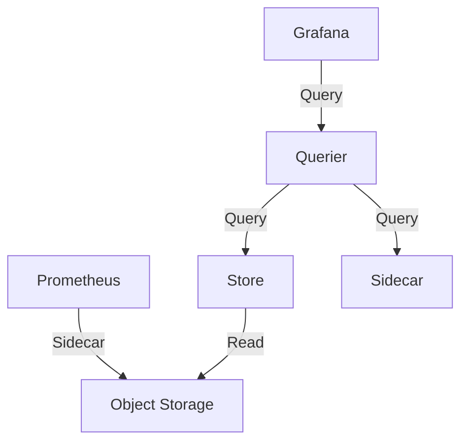

# Thanos

> **Description:** Highly available Prometheus setup with long-term storage capabilities.
> **Version:** Chart v1.x (Thanos v0.32+)
> **Last Updated:** 2025-12-04

## 📋 Prerequisites

List requirements before installation:
- [ ] Kubernetes Cluster v1.20+
- [ ] Helm v3+
- [ ] Object Storage (S3/GCS) - **Required**

---

## 🏗️ Architecture

Thanos consists of several components: **Sidecar** (runs with Prometheus), **Store** (reads from S3), **Querier** (aggregates data), and **Compactor** (downsamples data).



---

## 🚀 Installation Guide

### Option 1: Installation via Helm (SteveHipwell Chart)

```bash
# 1. Add Helm Repo
helm repo add stevehipwell https://stevehipwell.github.io/helm-charts/
helm repo update

# 2. Create Namespace
kubectl create ns monitoring

# 3. Install/Upgrade
helm upgrade --install thanos stevehipwell/thanos \
  -n monitoring \
  -f values.yaml
```

---

## ⚙️ Configuration Details

**Key Configurations** (values.yaml)

| Parameter | Description | Default | Recommended |
| :--- | :--- | :--- | :--- |
| `objstoreConfig` | Object Storage Config | `nil` | **Required** |
| `query.enabled` | Enable Querier | `true` | `true` |
| `storeGateway.enabled` | Enable Store Gateway | `true` | `true` |
| `compactor.enabled` | Enable Compactor | `true` | `true` (Singleton) |

---

## ✅ Verification & Usage

### 1. Access Querier UI
```bash
kubectl port-forward svc/thanos-query 9090:9090 -n monitoring
# http://localhost:9090
```

### 2. Configure Grafana
Add a **Prometheus** data source in Grafana pointing to `http://thanos-query.monitoring.svc.cluster.local:9090`.

---

## 🔧 Maintenance & Operations

- **Compaction**: Ensure only ONE compactor is running per bucket to avoid corruption.
- **Retention**: Configure retention in Compactor.

---

## 📊 Monitoring & Alerts

- **Metrics**: All Thanos components expose Prometheus metrics.

---

## ❓ Troubleshooting

Common issues and fixes:

| Issue | Cause | Solution |
| :--- | :--- | :--- |
| Store Gateway Crash | OOM (Large Index) | Increase RAM or shard |
| Slow Queries | Too much raw data | Enable downsampling |

---

## 📚 References

- [Thanos Documentation](https://thanos.io/)
- [SteveHipwell Thanos Chart](https://github.com/stevehipwell/helm-charts/tree/master/charts/thanos)
