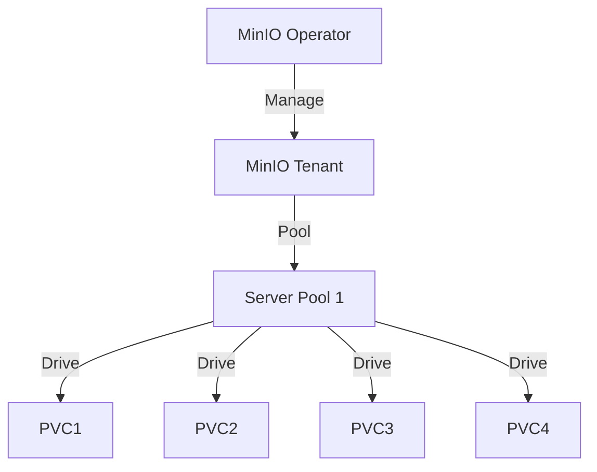

# MinIO (MinIO Operator)

> **Description:** High Performance Object Storage on Kubernetes using the official MinIO Operator.
> **Version:** Operator v5.x
> **Last Updated:** 2025-12-04

## 📋 Prerequisites

List requirements before installation:
- [ ] Kubernetes Cluster v1.21+
- [ ] Helm v3+
- [ ] Krew (kubectl plugin manager) - Optional but recommended

---

## 🏗️ Architecture

The MinIO Operator manages **Tenants**. Each Tenant is an isolated MinIO cluster.



---

## 🚀 Installation Guide

### 1. Install MinIO Operator

```bash
# 1. Add Helm Repo
helm repo add minio https://operator.min.io/
helm repo update

# 2. Create Namespace
kubectl create ns minio-operator

# 3. Install Operator
helm upgrade --install operator minio/operator \
  -n minio-operator \
  --create-namespace
```

### 2. Deploy MinIO Tenant

Apply the Custom Resource definition to create a Tenant.

```bash
kubectl create ns minio-tenant-1
kubectl apply -f minio-tenant.yaml -n minio-tenant-1
```

---

## ⚙️ Configuration Details

**Key Configurations** (minio-tenant.yaml)

| Parameter | Description | Default | Recommended |
| :--- | :--- | :--- | :--- |
| `spec.pools.servers` | Number of servers | `4` | `4+` |
| `spec.pools.volumesPerServer` | Drives per server | `4` | `4+` |
| `spec.requestAutoCert` | Auto-generate TLS | `true` | `true` |

---

## ✅ Verification & Usage

### 1. Access Console
The Operator creates a Console service for the Tenant.
```bash
kubectl -n minio-tenant-1 port-forward svc/myminio-console 9090:9090
# Login with credentials from Secret
```

### 2. Get Credentials
```bash
kubectl -n minio-tenant-1 get secret myminio-env-configuration -o jsonpath="{.data.config\.env}" | base64 -d
```

---

## 🔧 Maintenance & Operations

- **Upgrading**: Upgrade Operator via Helm. Upgrade Tenant by changing `image` in CR.
- **Scaling**: Add more pools in `minio-tenant.yaml`.

---

## 📊 Monitoring & Alerts

- **Metrics**: MinIO exposes Prometheus metrics. The Operator can generate ServiceMonitors.

---

## ❓ Troubleshooting

Common issues and fixes:

| Issue | Cause | Solution |
| :--- | :--- | :--- |
| Tenant not ready | Insufficient resources | Check CPU/RAM/PVC |
| TLS Error | Cert-Manager issue | Check Operator logs |

---

## 📚 References

- [MinIO Operator Docs](https://min.io/docs/minio/kubernetes/upstream/index.html)
