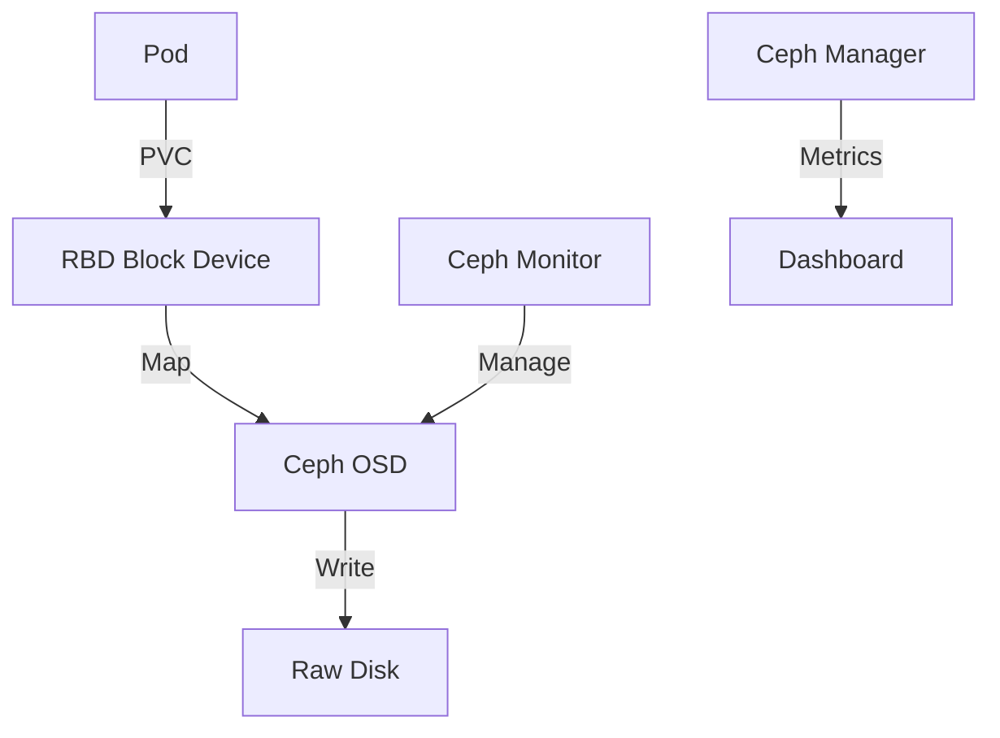

# Rook-Ceph

> **Description:** Open-source, cloud-native storage orchestrator for Ceph. Provides Block, Object, and File storage.
> **Version:** Chart v1.12.x (Rook v1.12.x, Ceph v18.x)
> **Last Updated:** 2025-12-04

## 📋 Prerequisites

List requirements before installation:
- [ ] Kubernetes Cluster v1.22+
- [ ] Raw devices (no partitions/filesystems) on nodes for OSDs
- [ ] Minimum 3 nodes for HA

---

## 🏗️ Architecture

Rook uses an Operator to manage the Ceph cluster. The Ceph cluster consists of Monitors (Mon), Managers (Mgr), and Object Storage Daemons (OSD).



---

## 🚀 Installation Guide

### Option 1: Installation via Helm

Rook requires two charts: the Operator and the Cluster.

```bash
# 1. Add Helm Repo
helm repo add rook-release https://charts.rook.io/release
helm repo update

# 2. Install Operator
helm upgrade --install rook-ceph rook-release/rook-ceph \
  -n rook-ceph --create-namespace

# 3. Install Cluster
# Wait for operator to be ready first!
helm upgrade --install rook-ceph-cluster rook-release/rook-ceph-cluster \
  -n rook-ceph \
  -f values.yaml
```

---

## ⚙️ Configuration Details

**Key Configurations** (values.yaml for cluster)

| Parameter | Description | Default | Recommended |
| :--- | :--- | :--- | :--- |
| `cephClusterSpec.storage.useAllNodes` | Use all nodes | `false` | `false` (Select specific nodes) |
| `cephClusterSpec.storage.useAllDevices` | Use all raw devices | `false` | `true` (If nodes are dedicated) |
| `cephBlockPools` | Define Block Storage Pools | `[]` | `[{name: replicated, spec: ...}]` |

---

## ✅ Verification & Usage

### 1. Verify Cluster Health
```bash
# Install toolbox (optional but recommended)
kubectl -n rook-ceph exec -it deploy/rook-ceph-tools -- ceph status
# Expected: HEALTH_OK
```

### 2. Access Dashboard
```bash
# Get password
kubectl -n rook-ceph get secret rook-ceph-dashboard-password -o jsonpath="{.data.password}" | base64 --decode
# Port forward
kubectl -n rook-ceph port-forward svc/rook-ceph-mgr-dashboard 8443:8443
```

---

## 🔧 Maintenance & Operations

- **Adding Storage**: Add new raw disks to nodes; Rook will automatically consume them if `useAllDevices: true`.
- **Upgrading**: Upgrade Operator chart first, then Cluster chart.

---

## 📊 Monitoring & Alerts

- **Prometheus**: Enable `monitoring.enabled: true` in `values.yaml` to deploy ServiceMonitors.

---

## ❓ Troubleshooting

Common issues and fixes:

| Issue | Cause | Solution |
| :--- | :--- | :--- |
| OSDs not created | Disk has partitions | Wipe disk (`zap`) |
| HEALTH_WARN | Clock skew or low space | Check NTP and disk usage |

---

## 📚 References

- [Rook Documentation](https://rook.io/docs/rook/latest/)
