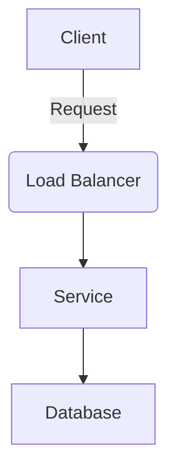

# [Tool Name / Software] (e.g. Apache Kafka, GitLab)

> **Description:** Brief description of what this tool is and its role in our stack (e.g., Main Message Queue).
> **Version:** Version installed in this guide (e.g. v3.4.0).
> **Last Updated:** YYYY-MM-DD

## 📋 Prerequisites

List requirements before installation:
- [ ] Kubernetes Cluster v1.2x+ or Linux Server Ubuntu 20.04
- [ ] Minimum RAM: 4GB / CPU: 2 Cores
- [ ] Dependencies (e.g., Helm, Docker, Cert-Manager)
- [ ] Storage Class (e.g., OpenEBS)

---

## 🏗️ Architecture

Brief overview of how this component fits into the infrastructure.



---

## 🚀 Installation Guide

### Option 1: Installation via Helm

```bash
# 1. Add Helm Repo
helm repo add [repo-name] [repo-url]
helm repo update

# 2. Create Namespace
kubectl create ns [namespace-name]

# 3. Install/Upgrade
helm upgrade --install [release-name] [repo-name]/[chart-name] \
  -n [namespace-name] \
  -f values.yaml
```

### Option 2: Installation via Docker Compose

```yaml
# docker-compose.yml example
version: '3'
services:
  app:
    image: [image-name]:tag
    ports:
      - "8080:80"
    volumes:
      - ./data:/data
```

---

## ⚙️ Configuration Details

**Key Configurations** (values.yaml or config.toml)

| Parameter | Description | Default | Recommended |
| :--- | :--- | :--- | :--- |
| `replicaCount` | Number of replicas | `1` | `3` (for HA) |
| `persistence.enabled` | Enable persistent storage | `false` | `true` |
| `resources.requests.memory` | Memory request | `256Mi` | `512Mi` |

---

## ✅ Verification & Usage

How to verify the installation is working:

```bash
kubectl get pods -n [namespace-name]
# Expected Output: Status Running
```

---

## 🔧 Maintenance & Operations

Common operational tasks:
- **Scaling**: `kubectl scale ...`
- **Upgrading**: `helm upgrade ...`

---

## 📊 Monitoring & Alerts

- **Metrics**: URL to Prometheus metrics or dashboard.
- **Alerts**: Key alerts to watch for (e.g., HighMemory, DiskPressure).

---

## 📦 Backup & Restore

- **Backup**: Command or procedure to backup data.
- **Restore**: Procedure to restore from backup.

---

## ❓ Troubleshooting

Common issues and fixes:

| Issue | Cause | Solution |
| :--- | :--- | :--- |
| Pod CrashLoopBackOff | OOMKilled | Increase memory limit |
| Connection Refused | Service not exposed | Check Service/Ingress |

---

## 📚 References

- [Official Documentation](https://example.com)
- [Helm Chart Repository](https://artifacthub.io)
