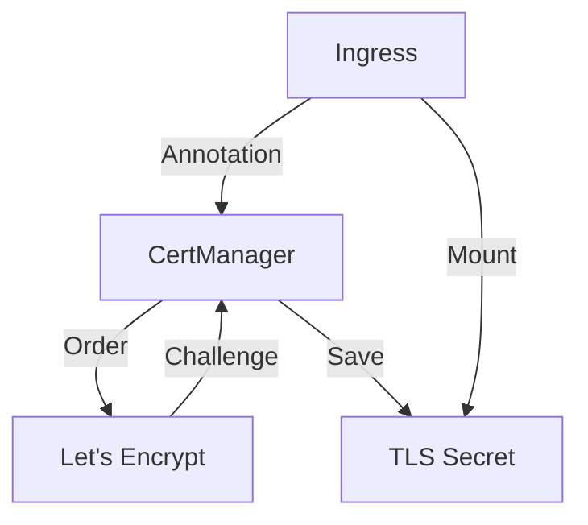

# Cert-Manager

> **Description:** Cloud native certificate management. Automatically issues and renews certificates from Let's Encrypt and other sources.
> **Version:** Chart v1.13.x (Cert-Manager v1.13.x)
> **Last Updated:** 2025-12-04

## 📋 Prerequisites

List requirements before installation:
- [ ] Kubernetes Cluster v1.20+
- [ ] Helm v3+

---

## 🏗️ Architecture

Cert-Manager watches for `Certificate` resources and interacts with Issuers (e.g., Let's Encrypt) to obtain signed certificates, storing them as Kubernetes Secrets.



---

## 🚀 Installation Guide

### Option 1: Installation via Helm

```bash
# 1. Add Helm Repo
helm repo add jetstack https://charts.jetstack.io
helm repo update

# 2. Create Namespace
kubectl create ns cert-manager

# 3. Install/Upgrade
helm upgrade --install cert-manager jetstack/cert-manager \
  -n cert-manager \
  -f values.yaml
```

---

## ⚙️ Configuration Details

**Key Configurations** (values.yaml)

| Parameter | Description | Default | Recommended |
| :--- | :--- | :--- | :--- |
| `installCRDs` | Install Custom Resource Definitions | `false` | `true` |
| `prometheus.enabled` | Enable Prometheus metrics | `true` | `true` |

---

## ✅ Verification & Usage

### 1. Create a ClusterIssuer (Let's Encrypt Staging)
```yaml
apiVersion: cert-manager.io/v1
kind: ClusterIssuer
metadata:
  name: letsencrypt-staging
spec:
  acme:
    email: your-email@example.com
    server: https://acme-staging-v02.api.letsencrypt.org/directory
    privateKeySecretRef:
      name: letsencrypt-staging
    solvers:
    - http01:
        ingress:
          class: nginx
```

### 2. Verify Issuer
```bash
kubectl get clusterissuer
# Expected: Ready=True
```

---

## 🔧 Maintenance & Operations

- **Upgrading**: `helm upgrade ...`. Always check release notes for breaking changes in CRDs.

---

## 📊 Monitoring & Alerts

- **Metrics**: Cert-Manager exposes metrics on port 9402. Monitor `certmanager_certificate_expiration_timestamp_seconds`.

---

## ❓ Troubleshooting

Common issues and fixes:

| Issue | Cause | Solution |
| :--- | :--- | :--- |
| Challenge Failed | Firewall/Network issue | Check Ingress reachability |
| Rate Limited | Too many requests | Use Staging Issuer |

---

## 📚 References

- [Cert-Manager Documentation](https://cert-manager.io/docs/)
