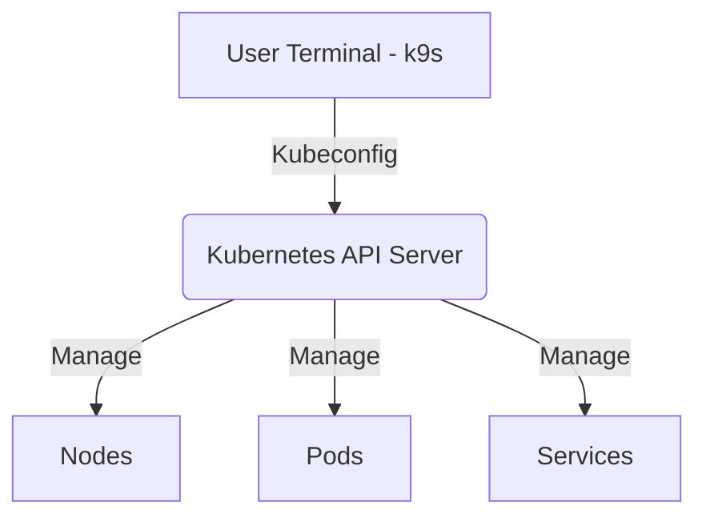

# k9s - Kubernetes CLI To Manage Your Clusters In Style

> **Description:** k9s is a terminal-based UI to interact with your Kubernetes clusters. It makes it easier to navigate, observe, and manage your applications in the wild.
> **Version:** Latest
> **Last Updated:** 2025-12-09

## 📋 Prerequisites

List requirements before installation:
- [ ] Kubernetes Cluster v1.16+
- [ ] `kubectl` installed and configured
- [ ] Terminal with 256 color support

---

## 🏗️ Architecture

k9s runs locally on your machine and communicates with the Kubernetes API server using your local kubeconfig.



---

## 🚀 Installation Guide

### MacOS (Homebrew)

```bash
brew install k9s
```

### Windows (Scoop)

```powershell
scoop install k9s
```

### Linux (Snap)

```bash
sudo snap install k9s
```

### Linux (Curl)

```bash
curl -sS https://webinstall.dev/k9s | bash
```

---

## ⚙️ Configuration Details

Configuration files are typically stored in `~/.config/k9s` (or `%LOCALAPPDATA%\k9s` on Windows).

**Key Files:**
- `config.yml`: Main configuration (refresh rates, log limits, etc.)
- `skin.yml`: Themes and color schemes.
- `hotkey.yml`: Custom hotkeys.
- `plugin.yml`: Custom plugins.

**Example `config.yml` snippet:**

```yaml
k9s:
  refreshRate: 2
  maxConnRetry: 5
  enableMouse: false
  headless: false
  logoless: false
  crumbsless: false
  readOnly: false
  noIcons: false
```

---

## ✅ Usage Guide

### Starting k9s

```bash
# Start k9s using default kubeconfig context
k9s

# Start k9s in a specific namespace
k9s -n my-namespace

# Start k9s with a specific context
k9s --context my-context
```

### Key Navigation & Bindings

| Key | Action |
| :--- | :--- |
| `:` | **Command mode**. Type resource type (e.g., `:pods`, `:svc`, `:deploy`) |
| `/` | **Filter mode**. Filter currently visible resources. |
| `?` | **Help**. Show available key bindings for current view. |
| `Enter` | **Select/View**. Drill down into resource details or logs. |
| `Esc` | **Back**. Go back to previous view or clear filter. |
| `Ctrl-c` | **Quit**. Exit k9s. |
| `d` | **Describe**. Describe selected resource (like `kubectl describe`). |
| `l` | **Logs**. View logs of selected pod. |
| `s` | **Shell**. Exec into selected pod container. |
| `shift-f` | **Port-Forward**. Setup port-forwarding for pod/service. |
| `y` | **YAML**. View resource YAML. |
| `e` | **Edit**. Edit resource (like `kubectl edit`). |

### Common Commands (Command Mode `:`)

- `:pods`: List Pods
- `:svc`: List Services
- `:deploy`: List Deployments
- `:ns`: List Namespaces
- `:ctx`: List Contexts
- `:pulse`: Show cluster health pulse (dashboard)
- `:xray [resource]`: X-Ray view of a resource (e.g. `:xray deploy`)
- `:popeye`: Run Popeye scanner (if installed)

---

## 🔧 Maintenance & Operations

- **Upgrading**:
  ```bash
  brew upgrade k9s
  ```
- **Reset Config**: Delete `~/.config/k9s/config.yml` to regenerate default config.

---

## ❓ Troubleshooting

| Issue | Cause | Solution |
| :--- | :--- | :--- |
| `dial tcp ... i/o timeout` | Network Connectivity | Check VPN or cluster reachability for kubeconfig. |
| Colors look wrong | Terminal settings | Ensure terminal supports 256 colors (`export TERM=xterm-256color`). |
| "You need to be authorized..." | RBAC Permissions | Ensure your kubeconfig user has permissions to list resources. |

---

## 📚 References

- [Official k9s Repository](https://github.com/derailed/k9s)
- [k9s Documentation](https://k9scli.io/)
